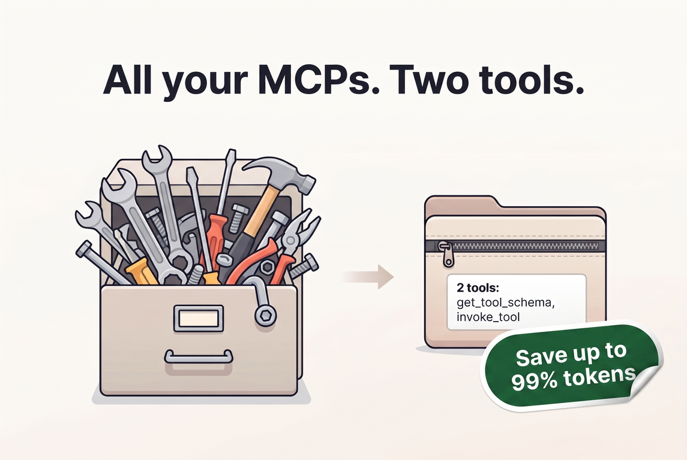

# MCP Compressing Router

[](https://github.com/ameshkov/mcp-compress-router/actions/workflows/ci.yml)
[](https://www.npmjs.com/package/mcp-compress-router)
[](https://github.com/ameshkov/mcp-compress-router/releases)

<p align="center">
    Compress all connected MCP into a single router MCP and save up to 99% on
    tokens.
</p>

<p align="center">
    
</p>

## Table of Contents

- [The Problem](#the-problem)
- [The Solution](#the-solution)
- [Prerequisites](#prerequisites)
- [Quick Start](#quick-start)
- [Configuration](#configuration)
    - [Config File Location](#config-file-location)
    - [Adding Downstream Servers](#adding-downstream-servers)
    - [Per-Server Enable/Disable](#per-server-enabledisable)
    - [Per-Server Tool Selection](#per-server-tool-selection)
    - [Inspecting Tools](#inspecting-tools)
    - [OAuth](#oauth)
        - [Redirect URL](#redirect-url)
        - [GitHub MCP (special case)](#github-mcp-special-case)
        - [Figma MCP (special case)](#figma-mcp-special-case)
    - [Custom Headers](#custom-headers)
    - [Secrets and Variable Expansion](#secrets-and-variable-expansion)
- [Connecting Coding Agents](#connecting-coding-agents)
    - [Opencode](#opencode)
    - [Claude Code](#claude-code)
    - [Codex](#codex)
    - [GitHub Copilot](#github-copilot)
- [How It Works](#how-it-works)

## The Problem

When you have multiple MCPs every request to the LLM will include ALL their
tools and descriptions, which can quickly eat up your token limit and increase
costs.

Check out this [example](docs/assets/tools.json) to understand how
quickly and how large it can get. This example represents just 3 popular MCP
servers: Notion MCP, Github MCP and Pylance MCP.

The overhead that is created is about **26K tokens**, but let's check how much
it actually costs you in USD. I will use Opus API pricing for calculation and
I'll assume that on average you have a 50-turn coding session (pretty
reasonable these days).

- Input: `26K tokens * $5 / 1M = $0.13`
- Cache write (caching is not free): `26K tokens * $6.25 / 1M = $0.1625`
- Cache read (49 turns): `26K tokens * 49 * $0.50 / 1M = $0.637`

So the total overhead on an average coding session is about **$0.9275**.
And that's just for 3 MCPs, imagine if you had more!

## The Solution

Instead of sending all the tools and descriptions every time, you can use a
single router MCP that compresses all the connected MCPs into one with just
two tools: `get_tool_schema`, `invoke_tool`.

`get_tool_schema` in the description only has a list of MCP servers, optional
descriptions (you can write them yourself), and a list of tool names for each
MCP server. [Here is an example](docs/assets/tools-compressed.json) of how the
compressed version looks like, and it takes about 900 tokens.

If we repeat our exercise with the compressed version, the total overhead on
an average coding session will be about **$0.032175** so we saved about
**96.5%** on costs!

This is just a basic example with just 3 MCP servers, the more MCP servers you
have, the more you save.

## Prerequisites

- **Node.js 24 or later** — the router runs on Node.js and is launched
  via `npx`, so no separate install step is needed.
- **A coding agent that supports stdio MCP servers** — this covers
  virtually every modern coding agent (opencode, Claude Code, Codex,
  GitHub Copilot, Cursor, etc.). The router exposes itself as a single
  stdio MCP server, so any agent that can spawn a local MCP process
  works.

## Quick Start

The router is published on npm as
[`mcp-compress-router`](https://www.npmjs.com/package/mcp-compress-router).
You do not need to install it — just run it with `npx`:

```bash
npx mcp-compress-router add github -- npx -y @modelcontextprotocol/server-github
```

This registers a downstream MCP server named `github` and writes it to
your [config file](#config-file-location). Repeat for every MCP server you
want to compress.

Then point your [coding agent](#connecting-coding-agents) at the router:

```bash
npx mcp-compress-router
```

When started without a subcommand, the router runs the MCP server over
stdio and exposes exactly two tools (`get_tool_schema`,
`invoke_tool`) to the agent.

## Configuration

The router reads its configuration from a single JSON(C) file that lists
every downstream MCP server to compress. You can edit this file by hand
or use the `add` / `remove` / `get` / `list` CLI commands.

### Config File Location

By default, the config file lives in a platform-specific directory
(`mcp.jsonc` is preferred over `mcp.json` when both exist):

- **Windows:** `%APPDATA%\mcp-compress-router\`
- **macOS:** `~/Library/Application Support/mcp-compress-router/`
- **Linux:** `~/.local/share/mcp-compress-router/`

You can override this with:

- The `-c, --config <path>` flag on any command, or
- The `MCP_COMPRESS_ROUTER_HOME` environment variable (points to a
  directory containing the config file).

If the file does not exist when a management command runs, it is created
automatically with an empty `{ "mcpServers": {} }` body.

A `.env` file in the **same directory** is loaded automatically at
startup, so you can keep secrets out of the config (see
[Secrets and Variable Expansion](#secrets-and-variable-expansion)).

> **Note on `-c` and credential storage:** when you override the config
> path with `-c /some/dir/mcp.json`, both `credentials.json` (OAuth
> tokens) and `mcp.json` live in `/some/dir/` — i.e. next to the config
> file you specified. The `.env` file, however, is loaded from the
> [configuration directory](#config-file-location) resolved by
> `MCP_COMPRESS_ROUTER_HOME` or the platform default, *not* from beside
> the explicit `-c` path. To co-locate `.env` with a custom config, set
> `MCP_COMPRESS_ROUTER_HOME` to the same directory.

### Adding Downstream Servers

Use the `add` command to register a downstream MCP server.

A good description helps the LLM route requests to the correct server.
When several servers are compressed behind the router, the model sees
each server's name, its description, and a list of tool names in the
`get_tool_schema` catalog. A clear description (e.g. *"GitHub API tools
for issues, PRs, and repos"*) steers the model toward the right server
far better than a bare name.

**stdio server** (a local process):

```bash
npx mcp-compress-router add github --description "GitHub API tools" \
  -- npx -y @modelcontextprotocol/server-github

# With environment variables
npx mcp-compress-router add github -e GITHUB_PERSONAL_TOKEN=ghp_xxx \
  --description "GitHub API tools" \
  -- npx -y @modelcontextprotocol/server-github
```

**HTTP server** (a remote endpoint; transport auto-detected from the
URL):

```bash
npx mcp-compress-router add my-http https://localhost:3100/mcp

# With a custom header
npx mcp-compress-router add my-http \
  --header "Authorization: Bearer mytoken" \
  https://localhost:3100/mcp
```

This produces a config file that looks like:

```jsonc
{
  "mcpServers": {
    "github": {
      "type": "stdio",
      "command": "npx",
      "args": ["-y", "@modelcontextprotocol/server-github"],
      "env": { "GITHUB_PERSONAL_TOKEN": "ghp_xxx" },
      "description": "GitHub API tools"
    },
    "my-http": {
      "type": "http",
      "url": "https://localhost:3100/mcp",
      "headers": { "Authorization": "Bearer mytoken" }
    }
  }
}
```

Both `.json` and `.jsonc` (JSON with comments and trailing commas) are
supported. CLI commands write plain `.json`; hand-edited files may use
`.jsonc`.

Other management commands:

```bash
npx mcp-compress-router list            # list all servers + auth status
npx mcp-compress-router get my-http     # show one server's config
npx mcp-compress-router remove my-http  # remove a server
```

### Per-Server Enable/Disable

Every server entry accepts an optional `enabled` boolean. When set to
`false`, the router skips that server entirely at startup — no process
spawn, no network connection, no discovery — and it is absent from the
`get_tool_schema` catalog. All configuration is preserved so the server
can be turned back on instantly. Omitting `enabled` (the default) means
enabled, keeping `mcp.json` clean and fully backward compatible.

Toggle it from the CLI without touching the rest of the config:

```bash
npx mcp-compress-router disable github   # writes "enabled": false
npx mcp-compress-router enable github    # removes the field
```

You can also set it at creation time:

```bash
npx mcp-compress-router add archive --disabled -- npx -y server-archive
```

### Per-Server Tool Selection

Two optional fields control which of a server's advertised tools are
exposed to the LLM. Both are arrays of glob patterns
([picomatch](https://github.com/micromatch/picomatch) syntax: `*`, `?`,
`{a,b}`, `[abc]`) matched against bare tool names:

- **`allowedTools`** — when present, only matching tools are exposed.
  An empty array (`[]`) exposes *no* tools (handy for staging a server
  while you build the list).
- **`disabledTools`** — removes matching tools from whatever would
  otherwise be exposed. The denylist wins: a tool matching both lists
  is blocked.

Filtered tools are hidden from the catalog *and* hard-rejected by
`invoke_tool`, so even an LLM that guesses a filtered name cannot
reach the downstream server.

```jsonc
"dangerous": {
  "type": "stdio",
  "command": "npx",
  "args": ["-y", "@some/mcp-server"],
  "allowedTools": ["list_issues", "get_pull_request"],
  "disabledTools": ["*_delete"]
}
```

A pattern that matches no real tool is not an error — the router logs a
warning (visible with `-v`) and continues. A malformed pattern is a
hard error at startup. Set filters at creation time with repeatable
flags:

```bash
npx mcp-compress-router add github \
  --allowed-tools list_issues \
  --allowed-tools get_pull_request \
  -- npx -y server-github
```

### Inspecting Tools

To see exactly which tools a server advertises — and which are
`[exposed]` or `[filtered]` under your current selection — connect to
it live without starting the full router:

```bash
npx mcp-compress-router tools github
```

This works regardless of the server's `enabled` state (inspecting a
disabled server is the primary way to build its allowlist). For HTTP
servers, stored OAuth credentials and `oauth` overrides are reused. If
the server cannot be reached or is missing required auth, the command
exits non-zero with a clear error and prints no partial list.

### OAuth

HTTP servers that require OAuth are supported. When you `add` an HTTP
server, the router probes it for OAuth metadata and starts the login
flow automatically if OAuth is advertised. You can also trigger it
manually:

```bash
npx mcp-compress-router login my-http
```

This opens your browser to complete the authorization-code flow. Tokens
are stored in a separate `credentials.json` in the same directory as
`mcp.json` (with `0600` permissions on Unix), so you can safely
share or version-control `mcp.json` without exposing tokens. Add
`credentials.json` to your `.gitignore`.

By default the router uses
[Dynamic Client Registration](https://datatracker.ietf.org/doc/html/rfc7591).
If your server requires a pre-registered client, add an `oauth` block to
the server entry (in `mcp.json`):

```jsonc
"my-http": {
  "type": "http",
  "url": "https://example.com/mcp",
  "oauth": {
    "clientId": "${MY_CLIENT_ID}",
    "clientSecret": "${MY_CLIENT_SECRET}",
    "scope": "read write"
  }
}
```

Only `clientId` is required; `clientSecret` and `scope` are optional.

#### Redirect URL

During `login` the router starts a temporary local HTTP server and uses
a loopback redirect URI (per [RFC 8252](https://datatracker.ietf.org/doc/html/rfc8252)):

```text
http://localhost:<port>/mcp-compress-router/oauth-callback
```

`<port>` is chosen by the OS at login time, so there is no fixed port to
register. When a provider requires a pre-registered redirect URI,
register the loopback form **without a port**:

```text
http://localhost/mcp-compress-router/oauth-callback
```

Most providers (GitHub included) match the scheme, host, and path and
ignore the port on `localhost`. If your provider demands a redirect URI
with an **exact port**, pin it with `--port`:

```bash
npx mcp-compress-router login my-http --port 8765
```

This binds the callback server to `8765`, so the redirect URI becomes
`http://localhost:8765/mcp-compress-router/oauth-callback` — register
that exact URL with the provider. To reuse the same port on every
`login`, persist it in the server's `oauth` block instead of passing the
flag each time:

```jsonc
"my-http": {
  "type": "http",
  "url": "https://example.com/mcp",
  "oauth": { "clientId": "${ID}", "callbackPort": 8765 }
}
```

`--port` overrides `oauth.callbackPort` for a single run. Pass `--port 0`
to force an OS-assigned port even when `oauth.callbackPort` is set.

#### GitHub MCP (special case)

The official GitHub MCP server at
`https://api.githubcopilot.com/mcp` advertises OAuth but does **not**
support Dynamic Client Registration, so you must pre-register a GitHub
OAuth App and pass its credentials via the `oauth` block. GitHub also
requires that the OAuth App be installed to the repositories and
organizations you want the MCP to access.

1. **Create a GitHub OAuth App.**
   Open <https://github.com/settings/developers> → *New OAuth App* (or
   *Register an application*). Give it any name and homepage URL.
2. **Configure the callback URL.**
   Set the *Authorization callback URL* to:
   `http://localhost/mcp-compress-router/oauth-callback`
3. **Add the GitHub MCP server by URL.**

   ```bash
   npx mcp-compress-router add github https://api.githubcopilot.com/mcp
   ```

4. **Set `oauth` credentials in `mcp.json`.**
   Copy the Client ID and generate a Client Secret, then put them in the
   server entry (use variable expansion to keep secrets out of the
   file):

   ```jsonc
   "github": {
     "type": "http",
     "url": "https://api.githubcopilot.com/mcp",
     "oauth": {
       "clientId": "${GITHUB_OAUTH_CLIENT_ID}",
       "clientSecret": "${GITHUB_OAUTH_CLIENT_SECRET}",
       "scope": "repo read:org"
     }
   }
   ```

   Request only the scopes the tools you need require; `repo read:org`
   covers the common repo and organization operations. Put the actual
   values in your `.env` file (see
   [Secrets and Variable Expansion](#secrets-and-variable-expansion)).
5. **Run the login command.**

   ```bash
   npx mcp-compress-router login github
   ```

   Your browser opens to authorize. After you approve, tokens are stored
   in `credentials.json` and the router can call GitHub MCP tools.

> **Note:** if you used a *GitHub App* (not a classic OAuth App), the
> App must be installed to the accounts/repos you want to access before
> login will succeed, and its client secret is generated under *General*
> → *Generate a new client secret*.

#### Figma MCP (special case)

The official Figma MCP server at `https://mcp.figma.com/mcp` does **not**
support Dynamic Client Registration through the standard MCP flow.
Instead you register an OAuth client via Figma's REST API using a
Personal Access Token, then pass the resulting credentials through the
`oauth` block. Figma also requires the redirect URI to use a **fixed
port** — the port you register is reused on every `login`, so you must
pin it with `oauth.callbackPort`.

1. **Create a Figma Personal Access Token.**
   Follow
   <https://developers.figma.com/docs/rest-api/personal-access-tokens/>
   to generate a PAT and export it as `FIGMA_PERSONAL_ACCESS_TOKEN`. It
   is only used to register the MCP client in the next step.

2. **Register the MCP client via Figma's API.**
   The redirect URI must use `127.0.0.1` on a fixed port — **the port
   matters**, it is reused on every `login`. This example uses `19876`:

   ```bash
   curl -X POST https://api.figma.com/v1/oauth/mcp/register \
     -H "Content-Type: application/json" \
     -H "X-Figma-Token: $FIGMA_PERSONAL_ACCESS_TOKEN" \
     -d '{
       "client_name": "Claude Code (figma)",
       "redirect_uris": ["http://127.0.0.1:19876/mcp-compress-router/oauth-callback"],
       "grant_types": ["authorization_code", "refresh_token"],
       "response_types": ["code"],
       "token_endpoint_auth_method": "none"
     }'
   ```

   Save the `client_id` and `client_secret` from the response (also note
   the `scope` is `mcp:connect`):

   ```json
   {
     "client_id": "CLIENTID",
     "client_secret": "CLIENTSECRET",
     "client_name": "Claude Code (figma)",
     "redirect_uris": ["http://127.0.0.1:19876/mcp-compress-router/oauth-callback"],
     "token_endpoint_auth_method": "none",
     "scope": "mcp:connect"
   }
   ```

3. **Add the Figma MCP server by URL.**

   ```bash
   npx mcp-compress-router add --transport http figma https://mcp.figma.com/mcp
   ```

4. **Set `oauth` credentials in `mcp.json`.**
   Put the client ID and secret from step 2 in the server entry, using
   the `mcp:connect` scope and the **same fixed port** you registered as
   `callbackPort`:

   ```jsonc
   "figma": {
     "type": "http",
     "url": "https://mcp.figma.com/mcp",
     "oauth": {
       "clientId": "${FIGMA_CLIENT_ID}",
       "clientSecret": "${FIGMA_CLIENT_SECRET}",
       "scope": "mcp:connect",
       "callbackPort": 19876
     }
   }
   ```

   Put the actual values in your `.env` file (see
   [Secrets and Variable Expansion](#secrets-and-variable-expansion)).

5. **Run the login command.**

   ```bash
   npx mcp-compress-router login figma
   ```

   Your browser opens to authorize. After you approve, tokens are stored
   in `credentials.json` and the router can call Figma MCP tools.

Other OAuth commands:

```bash
npx mcp-compress-router logout my-http  # remove stored credentials
```

For headless or CI environments, override the browser with the
`MCP_COMPRESS_ROUTER_BROWSER` environment variable. The authorization
URL is appended as a single final argument (no shell):

```bash
MCP_COMPRESS_ROUTER_BROWSER="node /path/to/headless-browser.js" \
  npx mcp-compress-router login my-http
```

The default login timeout is 120 seconds; override it with
`MCP_COMPRESS_ROUTER_LOGIN_TIMEOUT_MS`.

### Custom Headers

For HTTP servers that authenticate with a static API key or bearer
token instead of OAuth, use the `headers` field. You can set it via the
CLI or directly in `mcp.json`:

```bash
npx mcp-compress-router add my-http \
  --header "Authorization: Bearer mytoken" \
  --header "X-Custom: value" \
  https://example.com/mcp
```

```jsonc
"my-http": {
  "type": "http",
  "url": "https://example.com/mcp",
  "headers": {
    "Authorization": "Bearer ${MY_SERVER_TOKEN}",
    "X-Custom": "value"
  }
}
```

Header values support
[variable expansion](#secrets-and-variable-expansion), so you can keep
the actual token out of the config file.

### Secrets and Variable Expansion

Every string field in a server entry (`command`, `args`, `env`,
`headers`, `url`, `oauth.*`) is expanded against the process
environment at load time. Two syntaxes are supported:

| Syntax | Behavior |
| --- | --- |
| `${VAR}` | Replaced with the value of `VAR`. Throws if unset. |
| `${VAR:-default}` | Replaced with `VAR` when set and non-empty, otherwise `default`. |

Put your secrets in a `.env` file next to `mcp.json`:

```bash
# <config directory>/.env
GITHUB_PERSONAL_TOKEN=ghp_abc123
MY_SERVER_TOKEN=secret-token
```

Shell environment variables always take precedence over `.env` values.

## Connecting Coding Agents

Once your downstream servers are configured, connect your agent to the
router the same way you would connect any other MCP server — by
pointing it at `npx mcp-compress-router`. The examples below assume the
default [config location](#config-file-location); pass `-c <path>` if
you use a custom one.

### Opencode

Add the router to your `opencode.json` under `mcp`:

```json
{
  "$schema": "https://opencode.ai/config.json",
  "mcp": {
    "compress-router": {
      "type": "local",
      "command": ["npx", "-y", "mcp-compress-router"],
      "enabled": true
    }
  }
}
```

### Claude Code

Add this to a project-level `.mcp.json` in your workspace root, or to
your user-level config (applies to every project):

- **macOS:** `~/Library/Application Support/Claude/claude_desktop_config.json`
- **Windows:** `%APPDATA%\Claude\claude_desktop_config.json`
- **Linux:** `~/.config/Claude/claude_desktop_config.json`

```json
{
  "mcpServers": {
    "compress-router": {
      "command": "npx",
      "args": ["-y", "mcp-compress-router"]
    }
  }
}
```

### Codex

Add a `[mcp_servers.compress-router]` table to your Codex config (note
the snake_case key). The config path is `~/.codex/config.toml` on
macOS/Linux, or `%USERPROFILE%\.codex\config.toml` on Windows; you can
also scope it to a single project via `.codex/config.toml` in trusted
projects.

```toml
[mcp_servers.compress-router]
command = "npx"
args = ["-y", "mcp-compress-router"]
enabled = true
```

### GitHub Copilot

Add this to `.vscode/mcp.json` in your workspace (project-level, applies
only to that workspace), or to your **user-level** MCP settings which
apply across every workspace: open the Command Palette →
`Preferences: Open User Settings (JSON)` and add the same `servers`
block under the `mcp` key. Project-level and user-level entries are
merged, with project-level taking precedence.

```json
{
  "servers": {
    "compress-router": {
      "command": "npx",
      "args": ["-y", "mcp-compress-router"]
    }
  }
}
```

## How It Works

Once connected, the agent sees exactly **two tools**:

- **`get_tool_schema(server, tools)`** — Retrieves the JSON parameter
  schema for one or more tools on a downstream MCP server. The tool's
  description includes a compact listing of all servers and their
  available tool names.
- **`invoke_tool(server, tool, arguments)`** — Forwards a tool call to
  the downstream MCP server and returns the result.

The typical workflow:

1. The agent reads the compact catalog from the `get_tool_schema`
   description and identifies which tools it needs.
2. It calls `get_tool_schema` to learn the exact parameters.
3. It calls `invoke_tool` to execute a tool, validated against the
   cached schema.

This replaces thousands of tokens of tool listings with a compact ~900
token catalog, regardless of how many downstream servers you have.

For the full configuration and environment variable reference, see
[configuration.md](docs/configuration.md).
