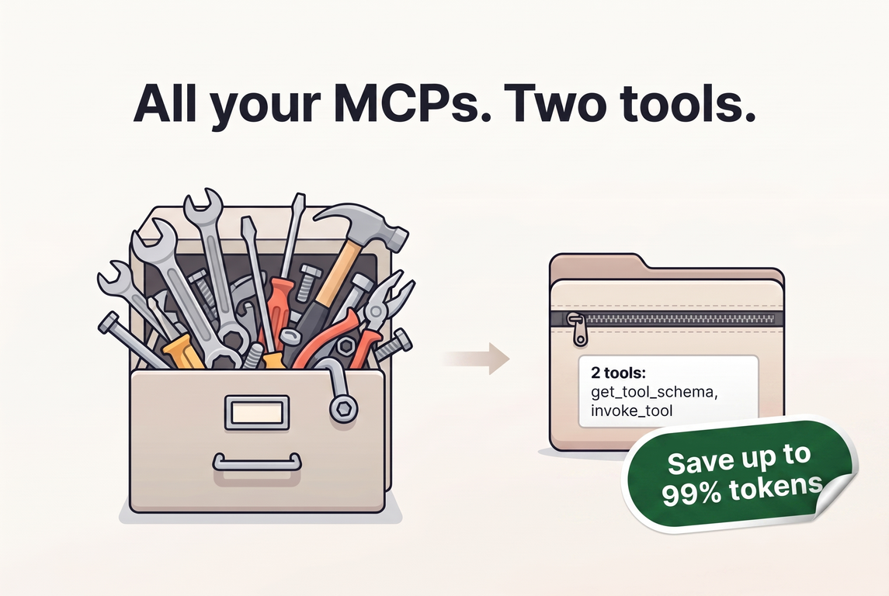

# MCP Compressing Router

[](https://github.com/ameshkov/mcp-compress-router/actions/workflows/ci.yml)
[](https://www.npmjs.com/package/mcp-compress-router)
[](https://github.com/ameshkov/mcp-compress-router/releases)

<p align="center">
    Compress all connected MCP into a single router MCP and save up to 99% on
    tokens.
</p>

<p align="center">
    
</p>

## Description

MCP Compress Router is a single MCP server for developers who connect
several MCP servers to a coding agent. Connected directly, each request
carries all of their tool definitions — about 26K tokens for three
popular servers, roughly $0.93 over a 50-turn session. The router
replaces those listings with two tools, `get_tool_schema` and
`invoke_tool`, and returns a tool's full schema only when the agent asks
for it. The same three servers compress to a catalog of about 600
tokens, cutting the overhead by roughly 97.7%. See
[About token overhead](docs/explanation/token-overhead.md) for the cost
model.

The router helps most in two cases:

- **You use more than one coding agent.** Connect each agent to the
  router once and manage every downstream MCP server in one place.
- **Your agent loads full tool definitions on every request.** The
  router saves the most where the agent sends every definition on every
  turn.

The actual savings depend on the coding agent: some agents already keep
tool definitions out of their requests with their own algorithms (see
[Measured savings](#measured-savings) below).

## Prerequisites

- **Node.js 24 or later** — the router runs on Node.js and is launched
  via `npx`, so no separate install step is needed.
- **A coding agent that supports stdio MCP servers** — opencode, Claude
  Code, Codex, GitHub Copilot, Cursor, and most other modern agents.

## Quick Start

The router is published on npm as
[`mcp-compress-router`](https://www.npmjs.com/package/mcp-compress-router).
You do not need to install it — just run it with `npx`.

Setup is two steps: connect your coding agent to the router, then add
the MCP servers you want to compress.

### 1. Connect your coding agent

Register the router the same way you register any other stdio MCP
server, at the **user** scope (or your agent's equivalent). It reads
its server list from a
[user-wide config file](docs/reference/configuration.md#configuration-file-location),
so every project shares one compressed catalog:

```sh
opencode mcp add mcp-compress-router -- npx -y mcp-compress-router@latest
```

See [Connect your coding agent](docs/guides/connect-coding-agent.md)
for Claude Code, Codex, GitHub Copilot (VS Code), and other agents.

### 2. Add downstream MCP servers

Use the `add` command to register each MCP server you want to compress:

```bash
npx mcp-compress-router@latest add playwright \
  --description "Browser automation for testing and inspecting web pages." \
  -- npx -y @playwright/mcp
```

The `add` command requires a short description so the LLM can tell what
the server is and when to use it; a hand-edited config may omit it, and
the catalog then skips that description. Use environment variables to
keep secrets out of the config:

```bash
npx mcp-compress-router@latest add github \
  --description "GitHub API tools for browsing repositories, issues, and pull requests." \
  -e GITHUB_PERSONAL_TOKEN=ghp_xxx \
  -- npx -y @modelcontextprotocol/server-github
```

HTTP servers, custom headers, OAuth, per-server tool filters, and
enable/disable are covered in the
[configuration reference](docs/reference/configuration.md).

### 3. Verify and use

Check that everything is wired up:

```bash
npx mcp-compress-router@latest list
```

Then start a new session in your coding agent. The agent picks up the
router's two tools — `get_tool_schema` and `invoke_tool` — and uses
them to discover and call every server you added, without ever seeing
the raw tool listings of each downstream server. `get_tool_schema`
accepts a server name alone to list that server's tools, or a server
and tool names to return their parameter schemas.

## Acknowledgements

- [mcp2cli](https://github.com/knowsuchagency/mcp2cli) — a very similar
  idea of how MCP can be compressed, but to a CLI.
- [mcp-compressor](https://github.com/atlassian-labs/mcp-compressor) —
  also a very similar idea; the "two tools" approach was borrowed from
  this project, though it only compresses a single MCP server.

## Measured Savings

Newer coding agents have caught up: Claude Code's Tool Search, Codex
CLI's code mode, and OpenCode V2's Code Mode each defer MCP tool
definitions on their own, so a current agent already keeps most
definitions out of its requests. With one of those agents on its own,
you may not need the router for token savings — the table below shows
how little it adds there. With several agents, the router remains the
single place where every downstream MCP server is connected,
configured, and authenticated, no matter how each agent defers tools.

Measured router-vs-direct savings (September 2026; total tokens depend
on the session's turn count, so the per-turn column is the stable
signal):

| Coding agent | Total token savings | Per-turn context savings | Cost savings |
| --- | ---: | ---: | ---: |
| OpenCode V1 | 39.8% | 33.1% | 17.5% |
| GitHub Copilot CLI | 49.7% | 33.0% | 21.4% |
| Claude Code, Tool Search off | 31.7% | 31.7% | 8.9% |
| Codex CLI | 1.9% | 1.9% | 9.1% |
| Claude Code, Tool Search on | 1.1% | 1.1% | 1.1% |
| OpenCode V2 | -8.6% | -1.2% | -1.8% |

Negative values mean the router used more. Cost figures come from each
agent's own accounting and are approximate. See
[Benchmarks](bench/README.md#results) for the full tables.

## Documentation

### Using the router

- [Configuration reference](docs/reference/configuration.md) — every
  config field, CLI command, and environment variable
- [Connect your coding agent](docs/guides/connect-coding-agent.md)
- [Authenticate with OAuth](docs/guides/oauth-login.md)
- [Connect the GitHub MCP server](docs/guides/oauth-github.md)
- [Connect the Figma MCP server](docs/guides/oauth-figma.md)
- [About token overhead](docs/explanation/token-overhead.md) — the
  problem, the cost model, and the two-tool workflow

### Contributing

- [Development guide](DEVELOPMENT.md) — set up, build, run, and debug
  from a repository clone
- [Benchmarks](bench/README.md) — harness, measured savings, and how to
  reproduce a run
- [Manual QA](qa/README.md) — the Compose stack and test plans
- [Releasing](docs/guides/releasing.md) — releases and canary builds
- [About the architecture](docs/explanation/architecture.md)
- [About the process lifecycle](docs/explanation/process-lifecycle.md)
- [About development practices](docs/explanation/development-practices.md)
- [Changelog](CHANGELOG.md)
- [LLM agent rules](AGENTS.md)
